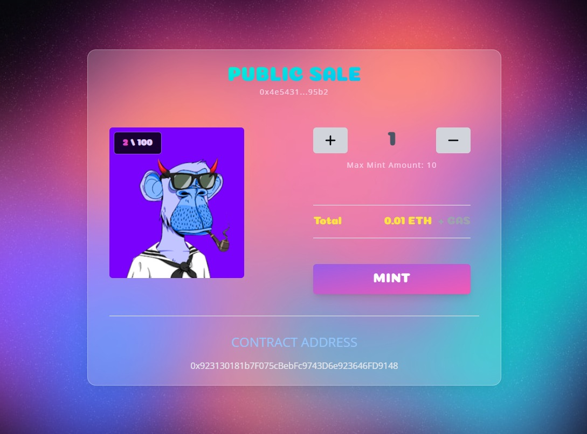

https://boredapemint.netlify.app





#To run the dapp Locally

### npm run dev

Try running some of the following tasks:

```shell
npx hardhat compile
npx hardhat accounts
npx hardhat clean
npx hardhat test
npx hardhat node
node scripts/sample-script.js
npx hardhat help

npx hardhat run scripts/deployContract.js --network rinkeby
npx hardhat run scripts/verifyContract.js --network rinkeby
Successfully verified contract BoredApe on Etherscan.
https://rinkeby.etherscan.io/address/0x923130181b7F075cBebFc9743D6e923646FD9148#code
npx hardhat verify --network rinkeby 0xc904d4fA240d2f13D05642D850D8803642DDEB8e
```

## Console.log data
import "hardhat/console.sol";

contract Greeter {
    string private greeting;

```js
constructor(string memory _greeting) {
    console.log("Deploying a Greeter with greeting:", _greeting);##
    greeting = _greeting;
}
```

Deploying on mainnet
When you are done with making changes and your minting dapp is just as you wanted it is time to deploy on ethereum mainnet. To do that;

Make sure you changed all env variables with yours. And also for the network you need to chose ethereum mainnet.
Update hardhat.config.js so that as network option you use mainnet not rinkeby. hardhat
While deploying your contract with hardhat you need to use mainnet as network-name
  # This command will deploy your smart contract on ethereum mainnet
  npx hardhat run scripts/deployContract.js --network mainnet

  # This command will verify your smart contract on mainnet etherscan
  npx hardhat run scripts/verifyContract.js --network mainnet


#Tech Stack
Client: React, TailwindCSS, web3.js

Server: Alchemy, NextJS, Hardhat

https://testnets.opensea.io/Sam03

Personal Note: Auto deploy Deactivated. Eslint Disable on deploy
